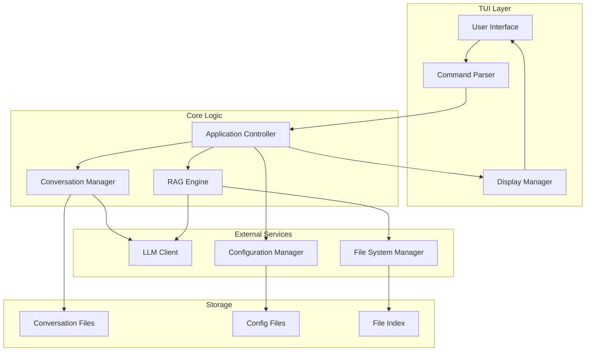

# Design Document

## Overview

The LLM TUI Assistant is a Rust-based terminal application that provides an interactive interface for communicating with Large Language Models while leveraging local file context through a structured RAG (Retrieval-Augmented Generation) system. The application emphasizes simplicity, responsiveness, and transparency in its operations.

The core architecture follows a modular design with clear separation between the TUI layer, LLM communication, file management, and RAG processing. The application supports multiple concurrent instances, streaming responses, and transparent conversation storage.

## Architecture

### High-Level Architecture



### Component Responsibilities

- **TUI Layer**: Handles user input, command parsing, and display rendering
- **Application Controller**: Orchestrates interactions between components
- **Conversation Manager**: Manages conversation state, history, and LLM communication
- **RAG Engine**: Implements the structured file selection and context retrieval process
- **File System Manager**: Handles file indexing, access, and monitoring
- **Configuration Manager**: Manages application settings and user preferences

## Components and Interfaces

### TUI Components

#### User Interface (`ui.rs`)
```rust
// UI state - only display-related information
pub struct TuiState {
    input_buffer: String,
    scroll_position: usize,
    command_mode: bool,
    status_message: Option<String>,
}

// Ratatui-based implementation
pub struct RatatuiRenderer {
    terminal: Terminal<CrosstermBackend<io::Stdout>>,
    state: TuiState,
}

pub trait TuiRenderer {
    fn render(&mut self, app_data: &AppDisplayData) -> Result<(), TuiError>;
    fn handle_input(&mut self) -> Result<Option<UserAction>, TuiError>;
}

// Data passed from app controller to UI for rendering
pub struct AppDisplayData {
    pub messages: Vec<Message>,
    pub provisional_mode: bool,
    pub rag_enabled: bool,
    pub current_status: String,
    pub streaming_response: Option<String>, // Partial response being streamed
}
```

#### Command Parser (`commands.rs`)
```rust
pub enum Command {
    Help,
    Config,
    Clear,
    ToggleRag,
    ToggleProvisional,
    AddSource(PathBuf),
    RemoveSource(PathBuf),
    ListSources,
    Exit,
}

pub fn parse_command(input: &str) -> Result<Command, CommandError>;
```

### Core Logic Components

#### Application Controller (`app.rs`)
```rust
pub struct AppController {
    conversation_manager: ConversationManager,
    rag_engine: RagEngine,
    config_manager: ConfigManager,
    file_manager: FileSystemManager,
}

impl AppController {
    pub async fn process_user_input(&mut self, input: UserInput) -> Result<Response, AppError>;
    pub async fn handle_command(&mut self, command: Command) -> Result<CommandResult, AppError>;
}
```

#### Conversation Manager (`conversation.rs`)
```rust
pub struct ConversationManager {
    current_conversation: Conversation,
    llm_client: Box<dyn LlmClient>,
    storage_path: PathBuf,
}

pub struct Conversation {
    id: String,
    messages: Vec<Message>,
    created_at: DateTime<Utc>,
    provisional_mode: bool,
}

impl ConversationManager {
    pub async fn send_message(&mut self, content: String, provisional: bool) -> Result<String, ConversationError>;
    pub async fn stream_response(&mut self, prompt: String) -> Result<ResponseStream, ConversationError>;
    pub fn save_conversation(&self) -> Result<(), ConversationError>;
}
```

#### RAG Engine (`rag.rs`)
```rust
pub struct RagEngine {
    file_manager: Arc<FileSystemManager>,
    enabled: bool,
}

pub struct RagContext {
    query: String,
    available_files: Vec<FileInfo>,
    keywords: Vec<String>,
    search_results: Vec<SearchResult>,
    selected_files: Vec<PathBuf>,
    file_contents: HashMap<PathBuf, String>,
}

impl RagEngine {
    pub async fn process_query(&self, query: String, llm_client: &dyn LlmClient) -> Result<RagContext, RagError>;
    pub async fn execute_rag_workflow(&self, context: &mut RagContext, llm_client: &dyn LlmClient) -> Result<(), RagError>;
}
```

### External Service Components

#### LLM Client (`llm.rs`)
```rust
pub trait LlmClient: Send + Sync {
    async fn send_message(&self, messages: &[Message]) -> Result<String, LlmError>;
    async fn stream_message(&self, messages: &[Message]) -> Result<ResponseStream, LlmError>;
}

pub struct OpenAiClient {
    api_key: String,
    model: String,
    base_url: String,
}

pub struct AnthropicClient {
    api_key: String,
    model: String,
}

// Future: LocalLlmClient for local model support
```

#### File System Manager (`filesystem.rs`)
```rust
pub struct FileSystemManager {
    indexed_sources: Vec<DataSource>,
    file_index: HashMap<PathBuf, FileInfo>,
    include_patterns: Vec<Regex>,
    exclude_patterns: Vec<Regex>,
}

pub struct DataSource {
    path: PathBuf,
    source_type: SourceType,
    last_indexed: DateTime<Utc>,
}

pub struct FileInfo {
    path: PathBuf,
    size: u64,
    modified: DateTime<Utc>,
    file_type: FileType,
    indexable: bool,
}

impl FileSystemManager {
    pub fn add_source(&mut self, path: PathBuf) -> Result<(), FileSystemError>;
    pub fn index_sources(&mut self) -> Result<(), FileSystemError>;
    pub fn search_files(&self, keywords: &[String]) -> Result<Vec<SearchResult>, FileSystemError>;
    pub fn read_file_content(&self, path: &PathBuf) -> Result<String, FileSystemError>;
}
```

#### Configuration Manager (`config.rs`)
```rust
pub struct ConfigManager {
    config_path: PathBuf,
    config: AppConfig,
}

pub struct AppConfig {
    llm_provider: LlmProvider,
    global_system_prompt: Option<String>,
    rag_enabled_default: bool,
    provisional_mode_default: bool,
    data_sources: Vec<PathBuf>,
    include_patterns: Vec<String>,
    exclude_patterns: Vec<String>,
    conversation_storage_path: PathBuf,
}

impl ConfigManager {
    pub fn load_config() -> Result<AppConfig, ConfigError>;
    pub fn save_config(&self) -> Result<(), ConfigError>;
    pub fn update_setting<T>(&mut self, key: &str, value: T) -> Result<(), ConfigError>;
}
```

## Data Models

### Core Data Structures

```rust
#[derive(Debug, Clone, Serialize, Deserialize)]
pub struct Message {
    pub role: MessageRole,
    pub content: String,
    pub timestamp: DateTime<Utc>,
    pub provisional: bool,
    pub context_files: Vec<PathBuf>,
}

#[derive(Debug, Clone, Serialize, Deserialize)]
pub enum MessageRole {
    User,
    Assistant,
    System,
}

#[derive(Debug, Clone)]
pub struct SearchResult {
    pub file_path: PathBuf,
    pub relevance_score: f32,
    pub matching_lines: Vec<(usize, String)>,
    pub snippet: String,
}

#[derive(Debug, Clone)]
pub enum UserInput {
    Message(String),
    Command(Command),
    KeyAction(KeyAction),
}

#[derive(Debug, Clone)]
pub enum UserAction {
    SendMessage,
    ExecuteCommand(Command),
    ToggleMode,
    ScrollUp,
    ScrollDown,
    Exit,
}
```

### Configuration Data Models

```rust
#[derive(Debug, Clone, Serialize, Deserialize)]
pub struct LlmProvider {
    pub provider_type: ProviderType,
    pub api_key: String,
    pub model: String,
    pub base_url: Option<String>,
    pub max_tokens: Option<u32>,
    pub temperature: Option<f32>,
}

#[derive(Debug, Clone, Serialize, Deserialize)]
pub enum ProviderType {
    OpenAi,
    Anthropic,
    Local, // For future local model support
}

#[derive(Debug, Clone, Serialize, Deserialize)]
pub enum SourceType {
    File,
    Directory,
}

#[derive(Debug, Clone, Serialize, Deserialize)]
pub enum FileType {
    Text,
    Markdown,
    Json,
    Config,
    Code(String), // Language extension
    Log,
    Binary, // Not indexable
}
```

## Error Handling

### Error Types

```rust
#[derive(Debug, thiserror::Error)]
pub enum AppError {
    #[error("TUI error: {0}")]
    Tui(#[from] TuiError),
    
    #[error("LLM error: {0}")]
    Llm(#[from] LlmError),
    
    #[error("RAG error: {0}")]
    Rag(#[from] RagError),
    
    #[error("File system error: {0}")]
    FileSystem(#[from] FileSystemError),
    
    #[error("Configuration error: {0}")]
    Config(#[from] ConfigError),
    
    #[error("Conversation error: {0}")]
    Conversation(#[from] ConversationError),
}

#[derive(Debug, thiserror::Error)]
pub enum LlmError {
    #[error("Network error: {0}")]
    Network(String),
    
    #[error("API error: {0}")]
    Api(String),
    
    #[error("Authentication error")]
    Authentication,
    
    #[error("Rate limit exceeded")]
    RateLimit,
    
    #[error("Context window exceeded")]
    ContextWindowExceeded,
}
```

### Error Recovery Strategies

- **Network Errors**: Implement retry logic with exponential backoff
- **File Access Errors**: Log error, continue operation, notify user
- **Configuration Errors**: Fall back to defaults, prompt for reconfiguration
- **LLM API Errors**: Display user-friendly messages, offer retry options
- **Context Window Errors**: Truncate/compress conversation history or reduce file context

## Testing Strategy

### Unit Testing

- **Component Isolation**: Each component tested independently with mocked dependencies
- **Configuration Testing**: Validate config loading, saving, and validation logic
- **File System Testing**: Test file indexing, searching, and access with temporary directories
- **RAG Workflow Testing**: Mock LLM responses to test the multi-step RAG process
- **Command Parsing Testing**: Comprehensive testing of command syntax and validation

### Integration Testing

- **End-to-End RAG Flow**: Test complete RAG workflow with real file system and mock LLM
- **Conversation Persistence**: Verify conversation saving and loading across sessions
- **Multi-Instance Safety**: Test concurrent access to shared resources
- **Streaming Response Handling**: Test response streaming and cancellation

### Test Data and Mocking

```rust
// Mock LLM client for testing
pub struct MockLlmClient {
    responses: VecDeque<String>,
    call_history: Vec<Vec<Message>>,
}

// Test utilities
pub fn create_test_config() -> AppConfig;
pub fn create_temp_file_structure() -> TempDir;
pub fn mock_rag_workflow() -> RagContext;
```

### Performance Testing

- **File Indexing Performance**: Test with large directory structures
- **Search Performance**: Benchmark keyword search across many files
- **Memory Usage**: Monitor memory consumption with large conversations
- **Streaming Latency**: Measure response streaming performance

### Error Scenario Testing

- **Network Interruption**: Test behavior during network failures
- **File Permission Issues**: Test handling of inaccessible files
- **Malformed Configuration**: Test recovery from corrupted config files
- **Large File Handling**: Test behavior with files exceeding size limits